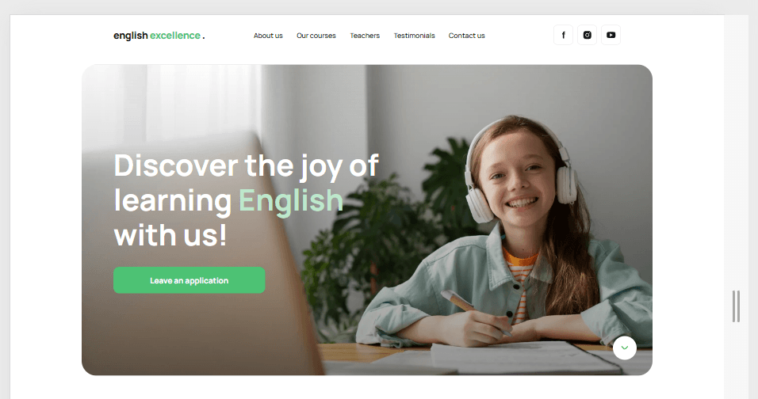
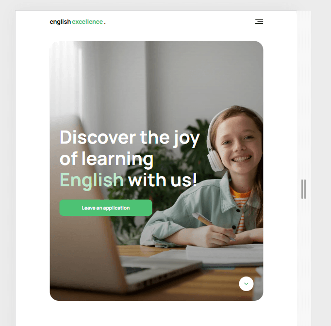
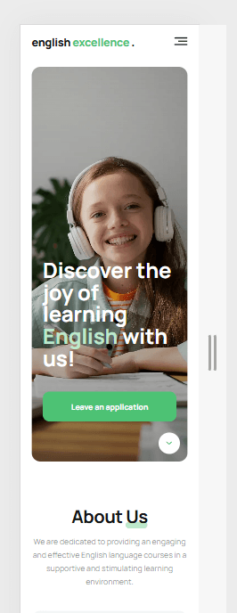

# English Excellence Landing

## Project Description

**English Excellence 2.0** is a responsive landing page developed as a team
project during a course HTML and CSS Fundamentals for User Interface Design.  
The website showcases an online English learning platform designed to help users
improve their speaking skills through personalized lessons, practical learning,
and flexible study options.

The project focuses on delivering a modern, user-friendly interface with
responsive layout, semantic HTML, clean styling architecture, and smooth
interactive elements across different devices.

## Project Links

This project includes the following resources:

- **Live Demo** — deployed project version available on GitHub Pages:  
  [https://milosska.github.io/layout-legends/](https://milosska.github.io/layout-legends/)

- **Figma Design** — original design layout used for development:  
  [https://www.figma.com/file/MrdZUmIfeT1bKd8u5GWLRt/English-Excellence-2.0?type=design&node-id=0%3A1&mode=design&t=ABsxLoZAXhbRJT6P-1](https://www.figma.com/file/MrdZUmIfeT1bKd8u5GWLRt/English-Excellence-2.0?type=design&node-id=0%3A1&mode=design&t=ABsxLoZAXhbRJT6P-1)

- **Technical Requirements** — project specification and development
  requirements:  
  [https://docs.google.com/spreadsheets/d/1JRDqMMRgQ6RbukIpl-18NuXQFMjm8HqGAQwZ553ykHU/edit#gid=0](https://docs.google.com/spreadsheets/d/1JRDqMMRgQ6RbukIpl-18NuXQFMjm8HqGAQwZ553ykHU/edit#gid=0)

## Features / Functionalities

This project is a **responsive landing page** built with a **mobile-first
approach**, designed to provide a smooth and user-friendly experience across
mobile, tablet, and desktop devices.

### User-Facing Features

- **Section-based navigation** with smooth scrolling to key content blocks
- **Hero section with a clear call-to-action** encouraging users to leave an
  application
- **About section** highlighting the platform’s main learning benefits
- **Pricing section** with multiple lesson plan options:
  - Practice
  - Standard
  - Individual
- **Promotional banner section** emphasizing the value of learning English
- **Teachers section** with instructor profiles and short descriptions
- **Application form** for submitting contact details and a message
- **Teacher selection field** inside the form for personalized requests
- **Testimonials section** with student feedback
- **Footer with contact details** and social media links

### Technical Highlights

- **Mobile-first responsive design**
- **Adaptive layout** optimized for breakpoints at **375px**, **768px**, and
  **1280px**
- **Flexible layouts** built with **Flexbox** and **CSS Grid**
- **Responsive images** using `image-set()` with **WebP** and **JPEG** formats
- **Adaptive backgrounds and images** for hero and section blocks
- **Reusable and modular structure** based on HTML partials and section-based
  CSS
- **Touch-friendly and accessible UI elements**
- **Interactive components** optimized for both desktop and mobile devices

## Technology stack

Project was build using indicated tech stack:

	<code></code>
	<code></code>
	<code></code>
    <code></code>
	<code></code>
	<code></code>
 	<code></code>
	<code></code>
	<code></code>

## Project installment

1. Make sure you have the LTS version of Node.js installed on your computer.
   Download and install it if necessary.
2. Install the basic dependencies of the project in the terminal with the
   command `npm install`
3. Start development mode by executing the command `npm run dev`
4. Go to http://localhost:5173 in your browser. This page will automatically
   reload after saving the changes to the project files.

## Project Structure

The project is organized using **HTML partials** and a **modular CSS
architecture** for better maintainability and team collaboration.

### HTML Structure

- `src/partials/` — reusable HTML partials
- `src/partials/components/` — shared UI components (e.g. mobile menu, socials)
- `src/partials/sections/` — individual landing page sections (hero, about,
  teachers, form, feedback, etc.)

### CSS Structure

- `src/css/styles.css` — main stylesheet importing all partial styles
- `src/css/base/` — variables, reset, and base styles
- `src/css/common/` — shared utilities and animations
- `src/css/components/` — reusable component styles
- `src/css/sections/` — styles for each page section

## Screenshots

### Desktop

### Tablet

### Mobile

